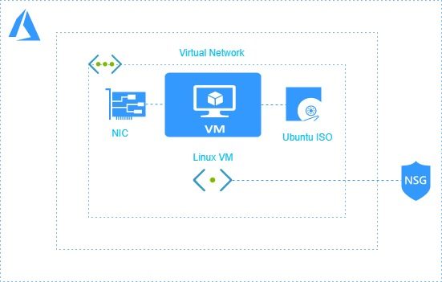

# Deploy Linux Virtual Machine using Terraform.

Azure Linux Virtual Machines provides on-demand, high-scale, secure, virtualized infrastructure using Red Hat, Ubuntu, or any Linux distribution of your choice. It can be used to create, configure, manage, update, and scale Linux VMs

Hashicorp Terraform is an Open source tool for provisioning and managing cloud infrastructure.

This Terraform script deploys a Linux Virtual Machine with Public IP, Storage Account and Virtual Network along with it. VM  is installed with Ubuntu 16.04 Operating System  and the Storage Account created stores all Boot Diagonistic Logs.

<p align="center">
</br>
<b>Figure 1.1: Architectural Diagram of the created Resources</b> 
</br>
</p>
<br />


## Installation and Usage
To deploy resources using this terraform template follow the steps mentioned below:

<a href="https://shell.azure.com" target="_blank">
 
</a>

<br />
<br/>

- Click on the Launch Cloud Shell button,login with Azure credentials and select Bash shell there to open Azure CLI.
- Upload [`vm.tf`](https://github.com/riyaagrahari/Terraform-Azure/blob/master/Terraform-Vm-Deploy/vm.tf) to deploy resources on Azure using terraform. Values to the variable are asked at runtime on CLI.( upload [`variables.tf`](https://github.com/riyaagrahari/Terraform-Azure/blob/master/Terraform-Vm-Deploy/variables.tf) ) 
- [`Configure Terraform`](https://docs.microsoft.com/en-us/azure/virtual-machines/linux/terraform-install-configure) if you are using Azure CLI on your local machine.
- Use following Commands on Azure CLI for getting your subscription_id, client_id, client_secret,tenant_id to add in this template.
```bash
az account set --subscription="${SUBSCRIPTION_ID}"
az ad sp create-for-rbac --role="Contributor" --scopes="/subscriptions/${SUBSCRIPTION_ID}"
```
```bash
echo "Setting environment variables for Terraform"
export ARM_SUBSCRIPTION_ID=your_subscription_id
export ARM_CLIENT_ID=your_appId
export ARM_CLIENT_SECRET=your_password
export ARM_TENANT_ID=your_tenant_id
export ARM_ENVIRONMENT=public
```
- Deploy your template using following commands:

    - ```terraform init ```
    - ```terraform plan ``` 
    - ```terraform apply```
    
## License
This project is licensed under the  License - see the [`LICENSE.md`](https://github.com/riyaagrahari/Terraform-Azure/blob/master/LICENSE) file for details
## Author
[`Riya Agrahari`](https://github.com/riyaagrahari/)<br />
