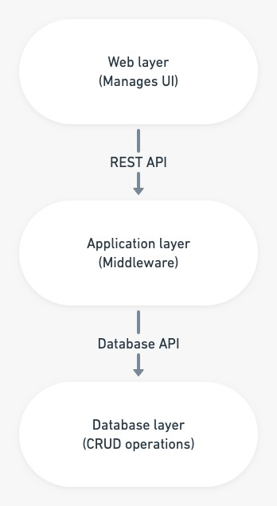

# BCDR using Terraform

Web-API-Database is a 3 tier architecture which decouples to presentation, business or application and database layers induvidually. The business layer exposes its API to applications as well as for the remote presentation layer. Remote presentation layer uses REST API. There is a internal database API for communications between application layer and database layer. REST API’s input is processed by the application layer to perform CRUD operations on the database.
 

 
    <b> Figure 1.1: Three Tier Architecture </b>  

  
This Terraform template creates a Virtual Network with 3 subnets (Webserver, API, Database). Further, Network Security Group are created for each and Inbound, Outbound rules are added to their respective NSG.
For default values , you may refer to [`variables.tf`](https://github.com/riyaagrahari/Terraform-Azure/blob/master/Terraform_Disaster_Recovery/variables.tf) file.

Below is the Architectural Diagram for the primary VNets and subnets which are created and network security rules are applied to subnets using NSG.

 

    <b> Figure 1.2: Detailed Architectural Diagram for Primary VNet.</b>

Replica of the primary vnet with its subnets and NSGs are created at some secondary location which comes up as recovery solution in case of a disaster. Communication between these Vnets is established using global peering.

In case of disaster, rules of NSG are appended opening custom ports on both Vnet, allowing database synchronization from secondary to primary region. 
Below is the architectural diagram for disaster recovery solution developed where a replica secondary vnet is created and peering is established between them

 
    <b> Figure 1.3: Azure Architectural Diagram for Disaster Recovery Solution- Primary and Secondary Vnet. </b>

  
