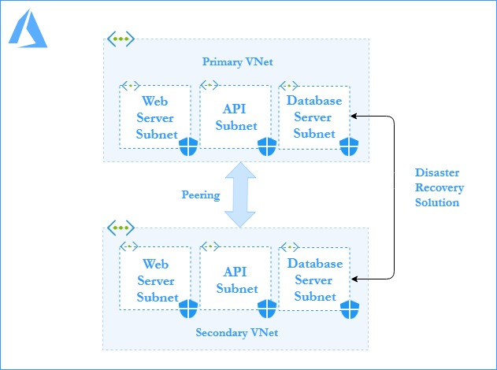

# Disaster Recovery Solution with ARM Template in Terraform.

Hashicorp Terraform is an Open source tool for provisioning and managing cloud infrastructure. 

This terraform script creates Web-API-Database three-tier architecture with specific network traffic security rules as Web is untrusted network, open to outside world, API is semi-trusted network as it communicates with both Web and Database and Database is fully-trusted network with no connection to Web. 

<b>Terraform script [`Master.js`](https://github.com/riyaagrahari/Terraform-Azure/edit/master/Terraform_with_ARM/Master.js) calls the ARM template [`Master.json`](https://github.com/riyaagrahari/Terraform-Azure/edit/master/Terraform_with_ARM/Master.json) in it using ```azurerm_template_deployment```. </b>Parameters can be changed by altering the values in Parameter section.

Web-API-Database is a 3 tier architecture which decouples to presentation, business or application and database layers induvidually. The business layer exposes its API to applications as well as for the remote presentation layer. Remote presentation layer uses REST API. There is a internal database API for communications between application layer and database layer. REST API’s input is processed by the application layer to perform CRUD operations on the database.
<br />

<p align="center">

<br />
    <b> Figure 1.1: Three Tier Architecture </b>  
</p>

<br /><br />
This Terraform template creates a Virtual Network with 3 subnets (Webserver, API, Database). Further, Network Security Group are created for each and Inbound, Outbound rules are added to their respective NSG.
For default values , you may refer to [`variables.tf`](https://github.com/riyaagrahari/Terraform-Azure/blob/master/Terraform_Disaster_Recovery/variables.tf) file.

Below is the Architectural Diagram for the primary VNets and subnets which are created and network security rules are applied to subnets using NSG.


<br />
<p align="center">
    <b> Figure 1.2: Detailed Architectural Diagram for Primary VNet.</b>
</p>
Replica of the primary vnet with its subnets and NSGs are created at some secondary location which comes up as recovery solution in case of a disaster. Communication between these Vnets is established using global peering.

Rules of NSG for Database Subnet are appended opening custom ports on both Vnet, allowing database synchronization from between primary and secondary Databases.

So if Disaster occures, recovery can be made by backed up data from secondary to primary Database.<br />

Below is the architectural diagram for disaster recovery solution developed where a replica secondary vnet is created and peering is established between them

<p align="center">

<br />
    <b> Figure 1.3: Azure Architectural Diagram for Disaster Recovery Solution- Primary and Secondary Vnet. </b>
</p>
<br /><br />


## Installation and Usage
- To deploy resources using this terraform template follow the steps mentioned below:
<br />
<a href="https://shell.azure.com" target="_blank">
 
</a>
<br />

- Click on the Launch Cloud Shell button,login with Azure credentials and select Bash shell there to open Azure CLI.

- Upload [`Master.tf`](https://github.com/riyaagrahari/Terraform-Azure/blob/master/Terraform_with_ARM/Master.tf) to deploy resources on Azure using terraform. Values to the variable are asked at runtime on CLI.

- Upload [`Master.json`](https://github.com/riyaagrahari/Terraform-Azure/blob/master/Terraform_with_ARM/Master.json) - ARM template file which you want to embedd in terraform on Azure CLI.

- [`Configure Terraform`](https://docs.microsoft.com/en-us/azure/virtual-machines/linux/terraform-install-configure) if you are using Azure CLI on your local machine.

- Deploy your template using following commands:

    - ```terraform init ```
    - ```terraform plan ``` 
    - ```terraform apply```
    
## Update existing NSG Rule
In case of disaster, rules of NSG for Database Subnet are appended opening custom ports on both Vnet, allowing database synchronization from secondary to primary region.

This can be done by loading the [`powershell.ps1`](https://github.com/riyaagrahari/Terraform-Azure/blob/master/Terraform_with_ARM/powershell.ps1) on the Azure powershell.
Change the values of Resource Group and NSG for database primary and secondary Subnet as per your existing resources , Upload the powershell script, cd to get into your home directory then run the powershell script.

So if Disaster occures, recovery can be made by backed up data from secondary to primary Database.

## License
This project is licensed under the  License - see the [`LICENSE.md`](https://github.com/riyaagrahari/Terraform-Azure/blob/master/LICENSE) file for details
## Author
[`Riya Agrahari`](https://github.com/riyaagrahari/)<br />

